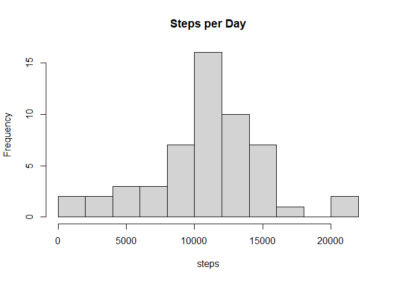
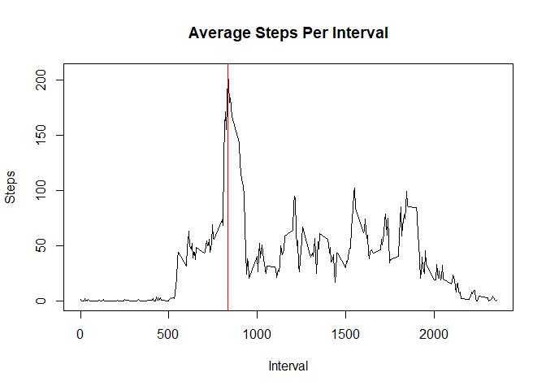
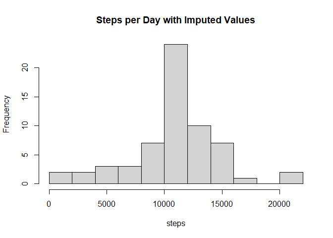
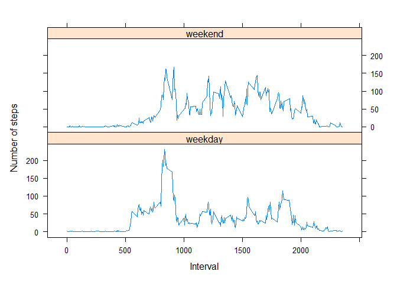

## Loading and preprocessing the data

The data was previously downloaded using the code that is not being run here:

if(!file.exists("./data")){dir.create("./data")} fileUrl <-
"https://d396qusza40orc.cloudfront.net/repdata%2Fdata%2Factivity.zip"
download.file(fileUrl, destfile="./data/repdata_activity.zip")
unzip("./data/repdata_activity.zip")


```r
library(data.table)
library(plyr)
library(lattice)
activity <- read.csv("activity.csv")  
activity[,2] <- as.Date(as.character(activity[,2]))  
dailytotal <- aggregate(activity$steps ~ activity$date, activity, sum)
names(dailytotal) <- c("date", "steps")  
averageinterval <- tapply(activity$steps,activity$interval,mean,na.rm=TRUE)  
```

## What is mean total number of steps taken per day?

A histogram of the daily total steps follows:


```r
hist(dailytotal$steps, 10,main="Steps per Day", xlab="steps")
```

<!-- -->

The mean and median steps: 


```r
mean(dailytotal$steps)
```

```
## [1] 10766.19
```

```r
median(dailytotal$steps)
```

```
## [1] 10765
```

## What is the average daily activity pattern?

The average daily activity pattern can be seen in the following plot of the average steps per interval
ignoring missing values for now.


```r
plot(y=averageinterval, x=names(averageinterval),type="l", main="Average Steps Per Interval",xlab="Interval", ylab="Steps")
abline(v=as.numeric(names(averageinterval[averageinterval == max(averageinterval)])), col="red")
```

<!-- -->


```r
maxai <- as.numeric(names(averageinterval[averageinterval ==
max(averageinterval)]))
```

The 5-minute interval that, on average, contains the maximum number of steps is **835** as shown in red on the time series plot above.

## Imputing missing values

```r
nas <- sum(is.na(activity$steps))
```

The dataset contains **2304** missing values.

These values appear to be distributed somewhat evenly across the investigated averages, by interval and by weekdays.


```r
summary(tapply(is.na(activity$steps), activity$interval, sum))
```

```
##    Min. 1st Qu.  Median    Mean 3rd Qu.    Max. 
##       8       8       8       8       8       8
```


```r
tapply(is.na(activity$steps), weekdays(activity$date), sum)
```

```
##    Friday    Monday  Saturday    Sunday  Thursday   Tuesday Wednesday 
##       576       576       288       288       288         0       288
```

The missing values will be replaced with the average number of steps for each interval.


```r
imean <- ddply(activity, "interval", summarise, msteps = mean(steps, na.rm=TRUE))
act <- merge(activity, imean)
act$steps[is.na(act$steps)] <- act$msteps[is.na(act$steps)]
act$date <- as.Date(act$date)
dailytotali <- aggregate(act$steps ~ act$date, act, sum)
names(dailytotali) <- c("dates", "steps")
hist(dailytotali$steps,10, main="Steps per Day with Imputed Values", xlab="steps")
```

<!-- -->

The mean and median steps: 


```r
mean(dailytotali$steps)
```

```
## [1] 10766.19
```

```r
median(dailytotali$steps)
```

```
## [1] 10766.19
```

## Are there differences in activity patterns between weekdays and weekends?

```r
act$day <- factor(sapply(weekdays(act$date), switch, "Saturday" = "weekend", "Sunday" = "weekend", "weekday"))
```

After adding a factor variable to sort the data by either "Weekday" or "Weekend", the average daily activity pattern for each factor can be visualized in the following plot of the average steps per interval with the imputed interval mean values replacing any missing values.


```r
actint <- ddply(act, .(interval,day), summarize, steps=mean(steps))
xyplot(steps~interval | day, actint, type="l", layout=c(1,2), ylab="Number of steps", xlab="Interval")
```

<!-- -->

The plots show a more evenly distributed number of steps on the weekend with more activity in the afternoon intervals versus the weekday trend which had a strong peak at the **835** interval.
